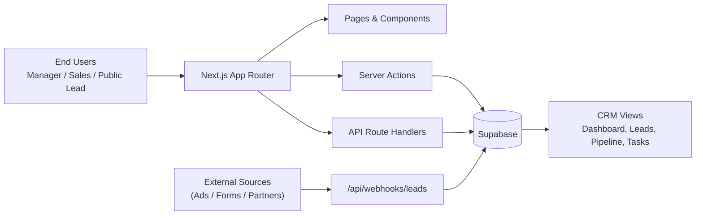
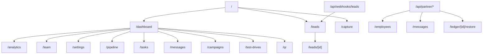
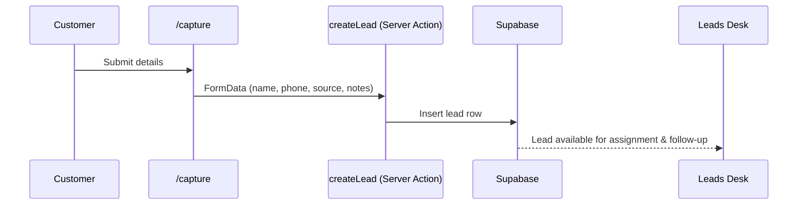
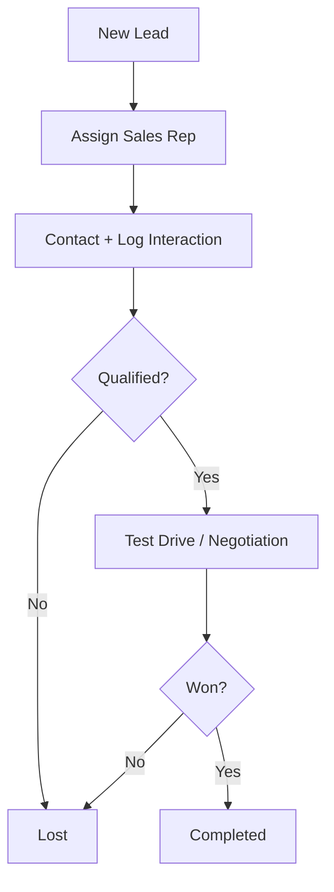
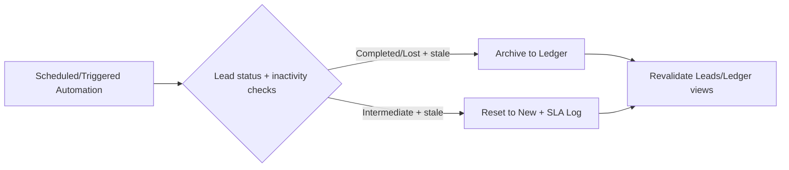
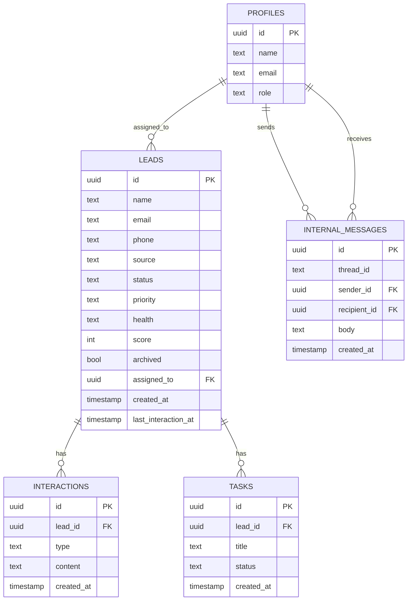
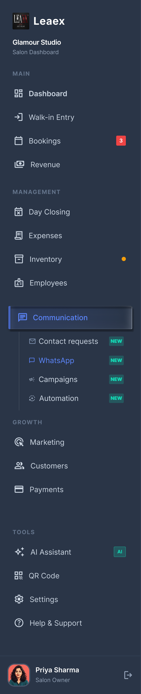
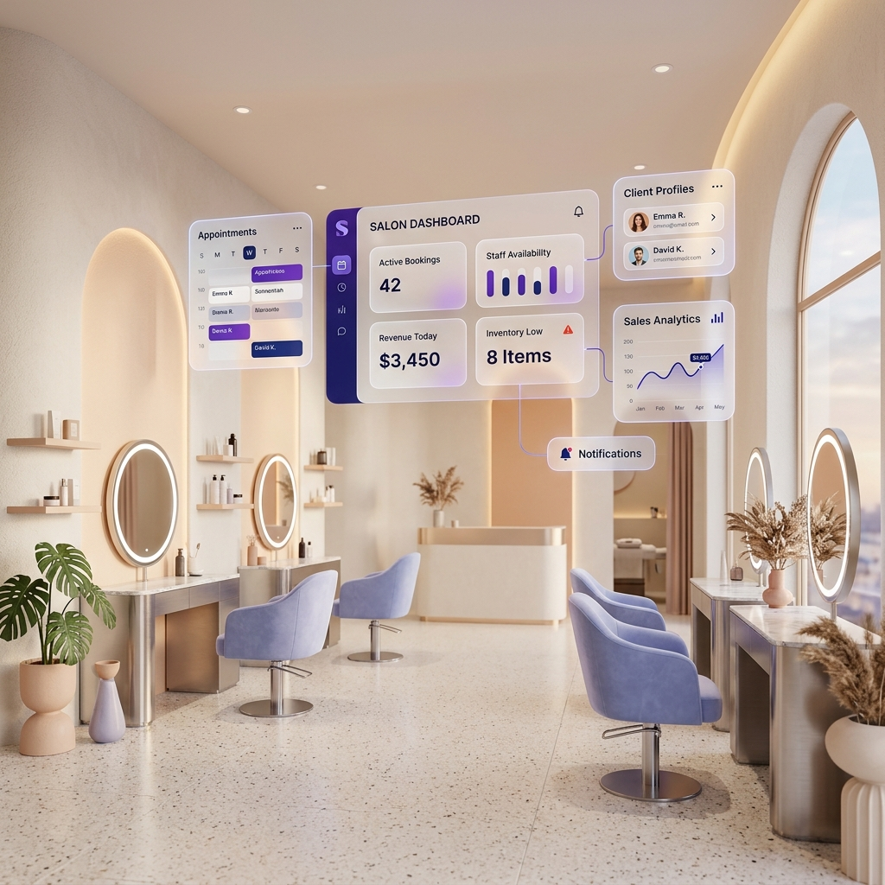

# LeadForge CRM — Assignment Documentation

LeadForge is a Next.js CRM prototype for dealership sales operations.

This README is structured for evaluator-friendly understanding of the project architecture, routes, workflows, APIs, and UI previews.

## 1) Project Summary

- **Domain:** Automotive dealership CRM
- **Primary users:** Manager, Sales Advisors
- **Core goal:** Convert inbound leads into bookings/sales with structured operations
- **Mode:** Sandbox-first UX with role switcher on landing page

---

## 2) Key Modules

- **Role-based workspace entry** (`/`)
- **Public lead capture form** (`/capture`)
- **Dashboard analytics & KPI cockpit** (`/dashboard`)
- **Leads desk and lead profile workspace** (`/leads`, `/leads/[id]`)
- **Pipeline Kanban board** (`/pipeline`)
- **Team management, tasks, test-drives, campaigns**
- **Internal messaging module**
- **Partner APIs + inbound webhook endpoints**

---

## 3) Tech Stack

- **Framework:** Next.js 16 (App Router)
- **Language:** TypeScript
- **UI:** React 19 + Tailwind CSS + shadcn/radix-style components
- **Data/Auth:** Supabase
- **Charts:** Recharts
- **DnD:** @dnd-kit / @hello-pangea/dnd

---

## 4) High-Level Architecture



---

## 5) Route Map (Evaluator Quick View)



---

## 6) Core Workflows

### 6.1 Lead Intake Workflow



### 6.2 Sales Operations Workflow



### 6.3 Automation & Ledger Workflow



---

## 7) Data Model (Conceptual)



---

## 8) Screenshots & UI Previews

> Current repository visual assets used as evaluator-friendly previews.

### Authentication / Entry Visuals


### Workspace Theme / Sidebar Preview



### Background Visual



---

## 9) API Snapshot

- `GET /api/partner/employees`
- `GET /api/partner/messages`
- `POST /api/partner/messages`
- `GET /api/partner/messages/[threadId]`
- `POST /api/partner/ledger/[id]/restore`
- `POST /api/webhooks/leads`

---

## 10) Local Setup

```bash
# install dependencies
npm install --legacy-peer-deps

# run development server
npm run dev
```

### Environment Variables

Create `.env.local` with at least:

```env
NEXT_PUBLIC_SUPABASE_URL=...
NEXT_PUBLIC_SUPABASE_ANON_KEY=...
SUPABASE_SERVICE_ROLE_KEY=...
```

---

## 11) Evaluation Guide (Fast Review Path)

1. Open `/` and verify role-based sandbox entry.
2. Open `/capture` and submit a sample lead.
3. Review `/dashboard` for KPI and operational cards.
4. Check `/leads` and `/pipeline` for lead lifecycle flow.
5. Verify API route presence under `src/app/api`.

---

## 12) Notes

- Some advanced modules rely on seeded Supabase data for richer dashboard and workflow states.

