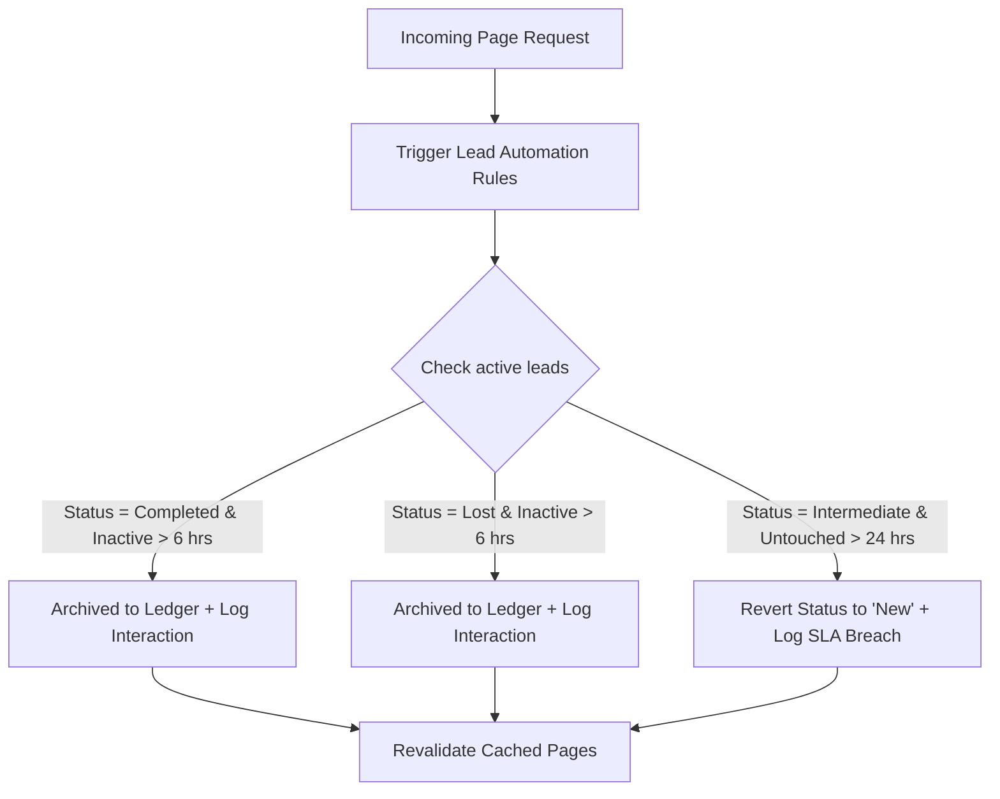

# LeadForge CRM Architecture & Workflow Reference Guide

Welcome to the **LeadForge Architecture and Workflow Reference Guide**. This document maps out the system's routing tree, page-level designs, component architectures, database models, and critical business workflows.

---

## 🗺️ 1. Complete Routing Tree

The system is organized into modular frontend pages and API endpoints under the Next.js `src/app/` directory:

```
src/app/
├── (dashboard)/                     # Group layout requiring Auth Context
│   ├── analytics/                   # Showroom Analytics & Performance
│   ├── automation/                  # Background workflow automation triggers
│   ├── campaigns/                   # Marketing campaigns manager
│   ├── contact-requests/            # Inbound contact forms desk
│   ├── dashboard/                   # Manager Executive Console
│   ├── leads/                       # Active Leads Desk
│   │   └── [id]/                    # Individual Lead Profile & Timeline Workspace
│   ├── ledger/                      # Soft-deleted Accounts Ledger (Manager-only)
│   ├── messages/                    # Direct Messaging Hub
│   ├── pipeline/                    # Kanban Stage Tracker
│   ├── qr/                          # In-Showroom QR Capture Generator
│   ├── settings/                    # Global Dealership & Profile Settings
│   ├── tasks/                       # Daily Tasks Checklist Desk
│   ├── team/                        # Team Directory & Performance Roster
│   └── test-drives/                 # Dynamic Test Drive Booking Terminal
├── api/                             # REST & Ingest Endpoints
│   ├── partner/
│   │   ├── employees/               # Get roster list
│   │   ├── ledger/[id]/restore/     # Soft-restore archived leads
│   │   └── messages/                # Direct internal chat endpoints
│   └── webhooks/
│       └── leads/                   # Public inbound API leads webhook
├── capture/                         # Public Customer Intake Form
└── page.tsx                         # Sandbox Selector / Landing Login page
```

---

## 🖥️ 2. Route & Page-Level Breakdown

### `○ /` — Sandbox Entry Selector
- **File**: `src/app/page.tsx`
- **Purpose**: A sandboxed login panel to easily toggle roles during manual testing and evaluation.
- **Workflow**:
  1. Instantly log in as **Michael Chen (Manager)** or **Sarah Jenkins / Priya Sharma (Sales Advisors)**.
  2. Commits chosen profiles directly to `AuthContext` state.
  3. Automatically routes Managers to `/dashboard` and Sales Advisors to `/leads`.

---

### `○ /capture` — Public Intake Portal
- **File**: `src/app/capture/page.tsx`
- **Purpose**: A public-facing web landing page where dealership prospects enter contact info and model preferences.
- **Workflow**:
  1. Captures Name, Email, Phone, Company, and Interest notes.
  2. Automatically maps incoming parameters from the query string (e.g. `?source=facebook`).
  3. **Data Protection**: Serializes interest fields as a structured JSON string under the `notes` column to bypass static schema constraints.
  4. Triggers the `createLead` server action to push the record directly into Supabase.

---

### `○ /analytics` — Performance reporting
- **File**: `src/app/(dashboard)/analytics/page.tsx`
- **Purpose**: Visual performance reports summarizing showroom trends and marketing attribution.
- **Visual Elements**:
  - **Revenue vs Target Line Chart** (Recharts): Compares target milestones against live lakhs closed.
  - **Lead Volume by Source Bar Chart** (Recharts): Evaluates performance across channels (Google, Facebook, Walk-in, Referrals).

---

### `○ /qr` — Offline QR Code Generator
- **File**: `src/app/(dashboard)/qr/page.tsx`
- **Purpose**: Generates dynamic customer capture points for show-room windows, events, or test cars.
- **Workflow**:
  1. Admins select an inbound source parameter (`offline`, `facebook`, `google`, `referral`).
  2. `<QRCodeSVG>` dynamically generates a scan code pointing to `/capture?source=selected_channel`.
  3. Customers scan the code to instantly submit their interest directly into the CRM.

---

### `○ /settings` — Dealership Config & Profile Desk
- **File**: `src/app/(dashboard)/settings/page.tsx`
- **Purpose**: Global showroom settings and personal employee preferences.
- **Manager-only Configs**:
  - **General**: Customize Showroom name, support email, and operational timezone.
  - **Notification Targets**: Set lead SLA Response breach targets (e.g. standard `15 minutes`).
  - **Integrations Desk**: Manage WhatsApp gateway credentials and sync webhooks.
- **Sales Advisor Configs**:
  - Modify personal profiles and select preferred themes (Clean Light, Dark Slate, or System Sync).

---

### `○ /team` — Roster & Win Rates
- **File**: `src/app/(dashboard)/team/page.tsx`
- **Purpose**: Real-time sales representative tracker.
- **UI Elements**:
  - Performance overview: Total Members, Active Advisors, Showroom Avg. Win Rate.
  - Roster grid: Displaying names, active leads, win rates, and live status (Online/Offline).

---

### `○ /test-drives` — Hyundai Demo Terminal
- **File**: `src/app/(dashboard)/test-drives/page.tsx`
- **Purpose**: Active management of on-road client demo sessions.
- **Key States**:
  - **Scheduled**: Standard booking assigned to a lead and sales representative.
  - **Active (On-Road)**: Triggers visual pulse animations indicating the customer is currently on a live highway run.
  - **Completed**: Saves on-road feedback and records notes back to the timeline history.
  - **Cancelled**: Soft cancellation with confirmation alerts.
- **Workflow**: Falls back to sandbox localStorage mode if database migration tables are not present, ensuring complete developer interaction.

---

### `ƒ /leads` — Active Ops Desk
- **File**: `src/app/(dashboard)/leads/page.tsx`
- **Purpose**: Central workspace for monitoring daily leads.
- **Key Modules & Panels**:
  - `<LeadsTable>`: Tabular lead grid with advanced filtering, sorting, and bulk reassignments.
  - **SLA Breach Warnings**: Live flashing warnings that trigger if a hot or high-scoring lead is left unserviced for over 30 minutes.
  - **Upcoming Test Drives**: Quick-access schedule panel synced directly to active routes.
  - **AI Suggestions Widget**: Intent patterns analyzed from WhatsApp queues.

---

### `ƒ /leads/[id]` — Individual Lead Workspace
- **File**: `src/app/(dashboard)/leads/[id]/page.tsx`
- **Purpose**: Premium 360-degree customer profile console.
- **Component breakdown**:
  - **SLA Tracker**: Computes real-time response times. Shows standard response targets or achieved response timestamps.
  - **Checklist Panel**: Manages standard SOP checkmarks (Send brochure, finance callback, test drive, price negotiation, deposit collection).
  - **Timeline**: A clean vertical feed logging all client actions, calls, emails, and notes.
  - **Similar Conversions Analysis**: Offers matching vehicle pitches and conversion patterns based on customer demographic data.

---

### `ƒ /ledger` — Permanent Archives (Manager Only)
- **File**: `src/app/(dashboard)/ledger/page.tsx`
- **Purpose**: Soft-deleted database logs keeping track of finalized and lost deals.
- **Security Rule**: Protected via `RoleGuard` (only accessible to Managers).
- **Workflow**:
  - Renders soft-deleted entries in an structured log.
  - Exposes quick actions to **Restore** leads, returning them directly back to active pipeline queues.

---

### `ƒ /pipeline` — Drag-and-Drop Kanban Board
- **File**: `src/app/(dashboard)/pipeline/page.tsx`
- **Purpose**: Visualizes deals across core stages.
- **Stages**: `New`, `Contacted`, `Qualified`, `Negotiation`, `Completed`, `Lost`.
- **Workflow**: Allows drag-and-drop status changes, triggering celebratory confetti on successful closings.

---

### `○ /messages` — Unified Messaging Desk
- **File**: `src/app/(dashboard)/messages/page.tsx`
- **Purpose**: Real-time internal staff messaging chat.
- **Component**: `<MessagingHub>` powers active conversational panels between advisors on duty.

---

## 🔌 3. REST API & Webhook Directory

### `GET /api/partner/employees`
- **Purpose**: Returns representative list for assignment queues.
- **Parameters**: `?exclude=<userId>` filters out the current user.

### `POST /api/partner/ledger/[id]/restore`
- **Purpose**: Restores archived leads back to active status.
- **Workflow**:
  1. Updates the `leads` table in Supabase setting `archived` to `false`.
  2. Inserts an interaction event log: *"Lead restored from Ledger back to active operations."*
  3. Revalidates Next.js cached pages `/leads` and `/ledger` immediately.

### `GET & POST /api/partner/messages`
- **Purpose**: Fetches active message threads or posts new messages.
- **Workflow**:
  - **GET**: Aggregates all direct messages involving the user, grouping them by a deterministic thread ID: `direct:sortedUserId1-sortedUserId2`.
  - **POST**: Inserts new message rows into `internal_messages`.

### `GET /api/partner/messages/[threadId]`
- **Purpose**: Retrieves direct message logs for a specific thread, sorted in chronological order.

### `POST /api/api/webhooks/leads`
- **Purpose**: Inbound lead sync webhook for car aggregator sites (like CarDekho) or third-party web forms.
- **Workflow**:
  1. Validates payload structure (requires `name`).
  2. Inserts the entry into the `leads` table with an initial lead score of `50`.

---

## ⚙️ 4. Background CRM Automation Engine

LeadForge contains a server action, `runLeadAutomationRules()`, that automatically executes whenever the `/leads`, `/pipeline`, or `/tasks` routes are called. This keeps the workspace self-cleaning:



---

## 💾 5. Database Schema Structure

The database utilizes five primary tables in Supabase:

### `leads`
| Column | Type | Description |
| :--- | :--- | :--- |
| `id` | `uuid` | Primary Key (Default gen_random_uuid()) |
| `name` | `text` | Customer's full name (Required) |
| `email` | `text` | Customer's email address |
| `phone` | `text` | Customer's phone number |
| `business_name` | `text` | Default: 'Individual Buyer' |
| `source` | `text` | Source parameter (e.g. website, walk-in) |
| `status` | `text` | `new`, `contacted`, `qualified`, `negotiation`, `completed`, `lost` |
| `priority` | `text` | `low`, `medium`, `high` |
| `health` | `text` | `cold`, `warm`, `hot` |
| `score` | `integer` | Lead score (0 to 100) |
| `notes` | `text` | Serialized flexible JSON data |
| `archived` | `boolean` | Soft-deleted archive flag (Default: false) |
| `archived_at` | `timestamp` | Time of soft deletion |
| `archived_by` | `text` | Actor who archived the lead |
| `assigned_to` | `uuid` | References `profiles.id` |
| `created_at` | `timestamp` | Intake timestamp |
| `last_interaction_at` | `timestamp` | Track response SLA markers |

### `profiles`
| Column | Type | Description |
| :--- | :--- | :--- |
| `id` | `uuid` | Primary Key |
| `name` | `text` | Full Representative Name |
| `email` | `text` | Login credentials email |
| `role` | `text` | `manager` or `sales` |

### `interactions`
| Column | Type | Description |
| :--- | :--- | :--- |
| `id` | `uuid` | Primary Key |
| `lead_id` | `uuid` | References `leads.id` |
| `type` | `text` | `call`, `email`, `meeting`, `note` |
| `content` | `text` | Chronological activity log description |
| `created_at` | `timestamp` | Timestamp of interaction |

### `tasks`
| Column | Type | Description |
| :--- | :--- | :--- |
| `id` | `uuid` | Primary Key |
| `lead_id` | `uuid` | References `leads.id` |
| `title` | `text` | SOP Checklist task description |
| `status` | `text` | `pending` or `completed` |
| `created_at` | `timestamp` | Task creation timestamp |

### `internal_messages`
| Column | Type | Description |
| :--- | :--- | :--- |
| `id` | `uuid` | Primary Key |
| `thread_id` | `text` | Deterministic `direct:userA-userB` |
| `sender_id` | `uuid` | References `profiles.id` |
| `recipient_id` | `uuid` | References `profiles.id` |
| `body` | `text` | Chat message text |
| `created_at` | `timestamp` | Sent timestamp |
